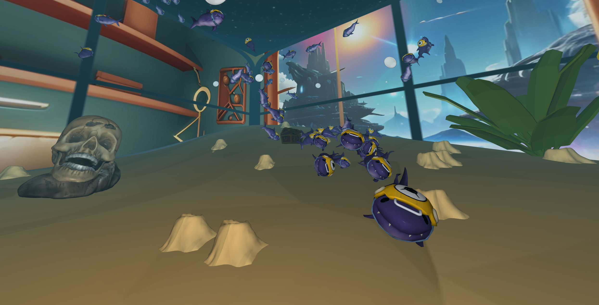

# Baby Shark is Back

## Description
Welcome to the "Baby Shark is Back" project! This project was developed as part of the INF443 course using CPG librairy. Our goal was to create an underwater 3D scene with a cartoon aesthetic.




## Features
- **Boids Model for Sharks**: Sharks are simulated with repulsion, alignment, and attraction forces, creating realistic group movements.
- **Oscillating Shader**: Simulates the swimming motion of sharks and seaweed.
- **Collision Management**: Includes collision forces for borders, the seabed, and objects.
- **Bubble Effect**: Uses semi-transparent 2D textures and interpolation splines for trajectories.
- **Fog**: Applies a blue fog effect to simulate underwater immersion.
- **Terrain and Skybox**: Terrain modified with Gaussian bumps and a skybox for a coherent environment.
- **Immersive Camera**: First-person view for an immersive experience, with the option to switch to an external camera.

## Installation
1. Clone the GitHub repository:
   ```bash
   git clone https://github.com/gitgab22/Baby-shark-is-back-3D-Project.git
2. Generate necessary files:
   Go to scenes_inf433/project/scripts and launch the _cmake_visual.bat files depending on your OS
3. Open:
   scenes_inf433/project/project.sln, Microsoft Visual Studio is recommended

## Usage
By default, the project starts in first-person camera mode.
To switch to external camera mode, comment/uncomment the indicated code sections in scene.hpp and scene.cpp.

## Project Structure
- **fonctions.cpp**: Utility functions for geometric and simulation calculations.
- **interpolation.cpp**: Interpolation functions for bubble trajectories.
- **scene.cpp**: Initialization and rendering of the scene, shark simulation.
- **terrain.cpp**: Underwater terrain generation and random position generation.

## Authors
Gabriel Mercier
Pierre-Antoine M.
